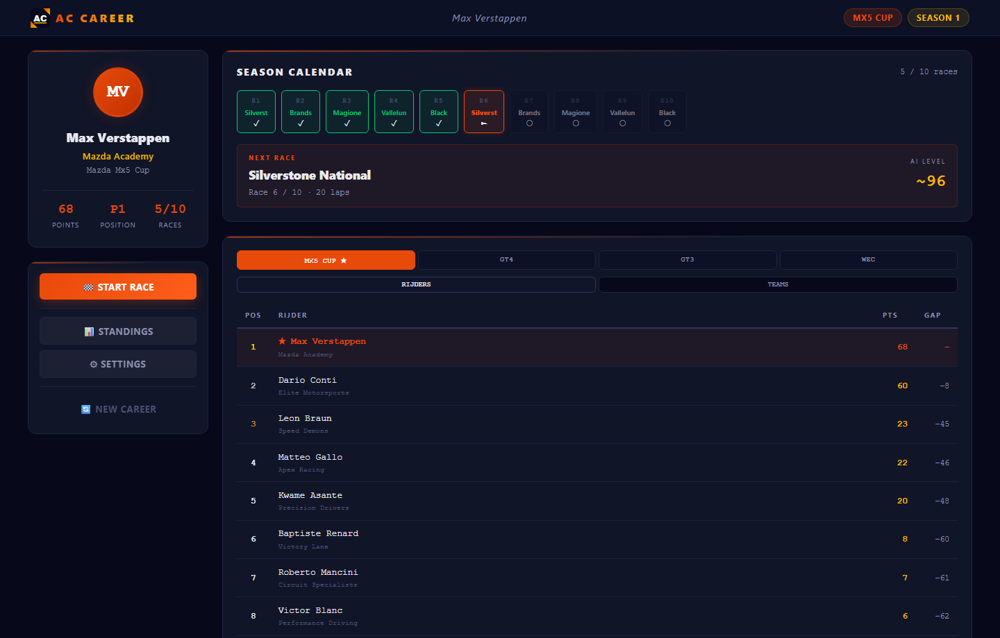
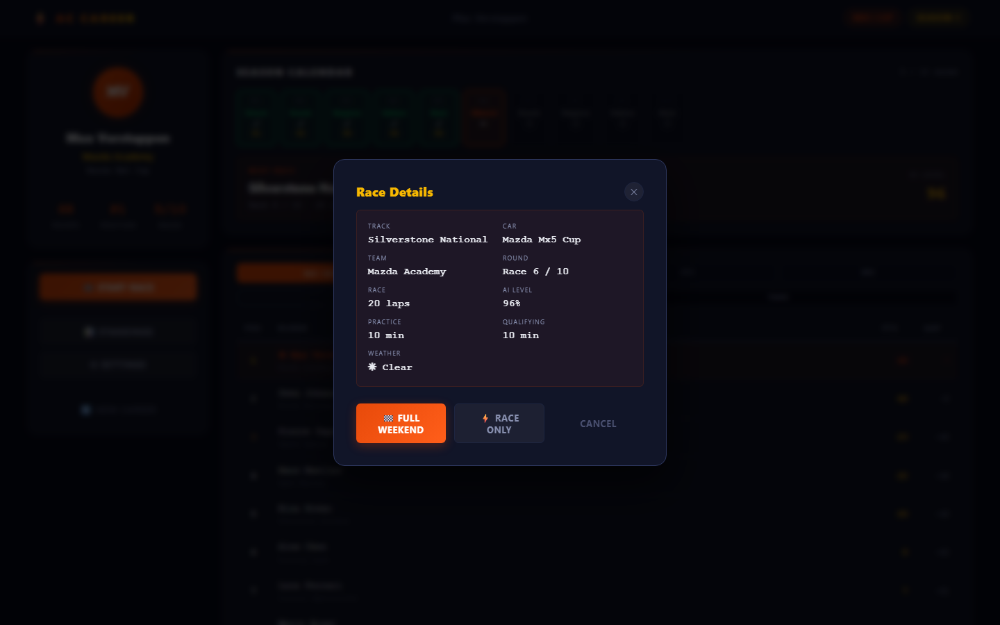
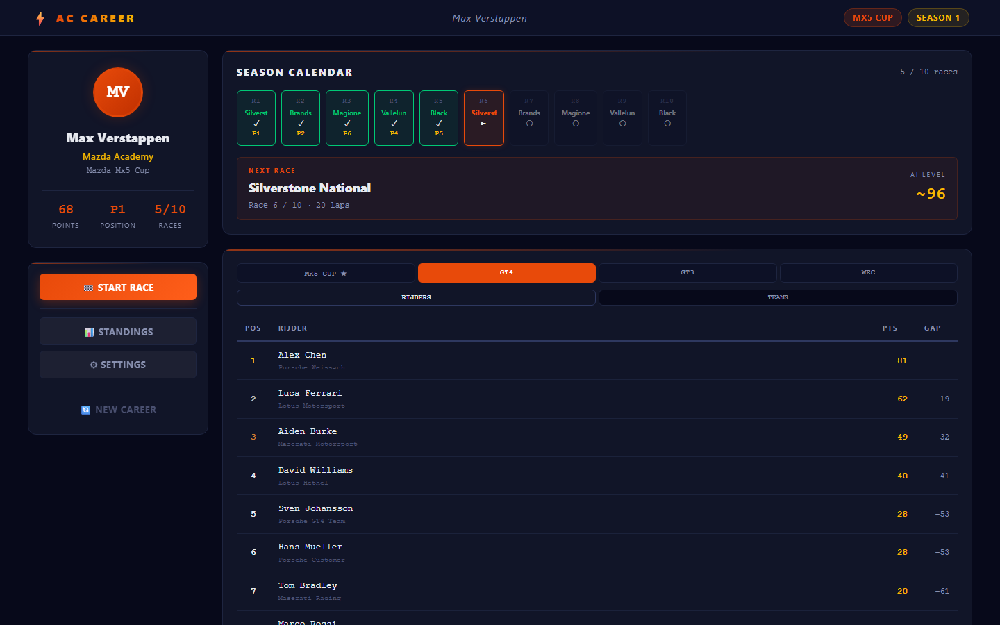
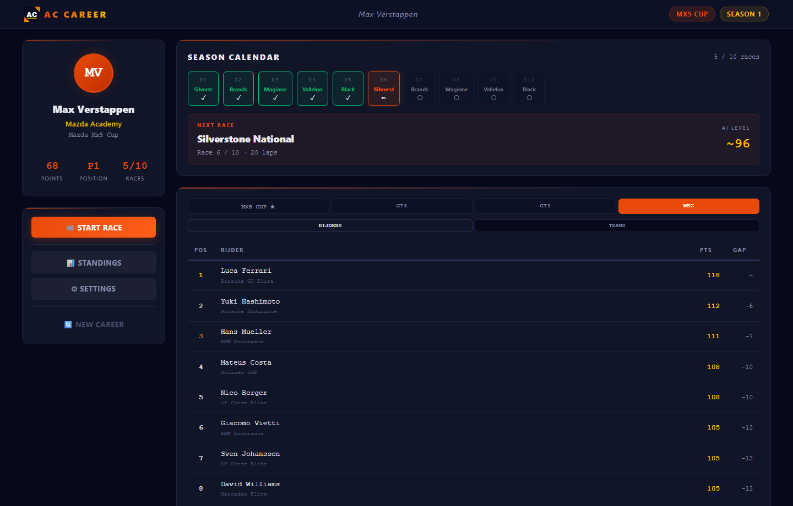

# AC CAREER MANAGER
## Professional Racing Career Simulator for Assetto Corsa

**Version:** 1.7.0
**Platform:** Windows 10/11
**Python:** 3.12 (required — pywebview does not support 3.13/3.14)

---

## OVERVIEW

AC Career Manager is a complete professional career mode system for Assetto Corsa. It opens in its own native window (no browser needed) and provides:

- **4-Tier Career Progression:** MX5 Cup → GT4 → GT3 → WEC
- **10 Races Per Tier** with dynamic team assignments
- **Contract System:** End-of-season team/car selection based on performance
- **Intelligent AI Scaling:** Difficulty increases as you progress
- **Native Desktop App:** Runs in its own window via pywebview (Edge WebView2)
- **Full Race Weekend:** Practice + Qualifying + Race in one AC launch, or Race Only
- **Weather Variety:** Weighted random weather per race (rain chance increases each tier)
- **Championship Tabs:** Browse all 4 championships simultaneously; switch between Driver and Team standings
- **2 Drivers Per Team:** GT4/GT3/WEC show both championship drivers per team; MX5 Cup is single-driver
- **Globally Unique Driver Names:** 120-name pool ensures no duplicate drivers across all 4 tiers
- **Per-Team Liveries:** Each AI car gets a distinct skin in every race (especially visible in MX5 Cup)
- **Promotion & Degradation:** Bottom finishers risk losing their seat; top-3 get scouted by higher-tier teams
- **App Logo & Icon:** Custom AC logo in topbar, WebView2 favicon, and EXE/taskbar icon
- **Driver Personalities:** 120 unique drivers each with nationality, skill, aggression, and archetype (Charger / Tactician / Wildcard / Journeyman)
- **Per-Driver AI:** AC race.ini uses individual `AI_LEVEL` and `AI_AGGRESSION` per car — aggressive drivers push harder, skilled drivers are faster
- **Driver Profile Cards:** Click any AI driver in standings to see a full profile popup (nationality flag, skill/aggression bars, archetype, current season stats)
- **Career History:** Season-end results stored per driver; profile card shows multi-season career record
- **Pre-Flight Checks:** Race modal warns you if a track or car mod is missing before launching AC
- **One-Click Launch:** Automatic AC integration

---

## SCREENSHOTS






---

## DOWNLOAD

**[⬇ Download AC_Career_Manager.exe (v1.8.0)](https://github.com/corveck79/ac-career-manager/releases/latest/download/AC_Career_Manager.exe)**

- Windows 10/11 only
- No Python installation needed
- ~13 MB single file
- Requires Assetto Corsa installed via Steam

---

## QUICK START

**Requirements:**
- Python **3.12** (not 3.13 or 3.14 — pywebview requires 3.12)
- Windows 10/11 (Edge WebView2 is pre-installed)
- Assetto Corsa installed via Steam

**Installation:**
```bash
# 1. Clone the project
git clone https://github.com/corveck79/ac-career-manager.git

# 2. Open command prompt in the app folder
# 3. Create virtual environment with Python 3.12
py -3.12 -m venv venv
venv\Scripts\activate

# 4. Install dependencies
pip install -r requirements.txt

# 5. Start the app
start.bat        # recommended: handles venv automatically
# OR
python app.py    # same result
```

On first run, a setup screen appears — enter your Assetto Corsa install path (or use the folder button to browse).

---

## FILE STRUCTURE

```
ac-career-manager/
├── app.py                    # Flask backend + pywebview window
├── career_manager.py         # Career logic & game rules
├── config.json              # All configuration (tunable!)
├── requirements.txt         # Python dependencies
├── start.bat               # Quick start script (auto-creates venv)
├── build.bat               # Build standalone EXE
│
├── templates/
│   └── dashboard.html      # Web UI (HTML)
│
└── static/
    ├── style.css          # CSS styling
    └── app.js             # Frontend JavaScript
```

---

## CONFIGURATION

Settings can be changed in the **Settings panel** (⚙ button in the app):
- AI base level (slider)
- AI variance per race (slider)
- Races per tier (slider)
- Assetto Corsa install path (with folder browser)

For advanced changes, edit `config.json` while the app is **stopped**.

### AC install path:
```json
"paths": {
  "ac_install": "C:\\Program Files (x86)\\Steam\\steamapps\\common\\assettocorsa"
}
```

### AI difficulty:
```json
"difficulty": {
  "base_ai_level": 85,
  "ai_variance": 1.5
}
```

---

## HOW TO PLAY

### Starting a Career
1. Click **"New Career"** in the app
2. Enter your driver name
3. You start in **MX5 Cup** with **Mazda Academy**
4. Dashboard shows your team, points, and next race

### Race Workflow
1. Click **"START RACE"** button
2. Review race details in modal
3. Choose **Full Weekend** (Practice + Qualifying + Race) or **Race Only**
4. Assetto Corsa opens and runs all sessions automatically
5. **Drive** in AC — AC handles session transitions
6. Close AC when done, then return to the app
7. Click **"Fetch Result from AC"** — position and best lap are read automatically
8. Confirm the result (or enter manually if needed)

### End of Season
After completing all races:
1. Season completes automatically
2. You receive contract offers based on your championship position
3. Choose which team/car you want next season
4. Progress to next tier

### Championship Points (F1 standard)
P1: 25 · P2: 18 · P3: 15 · P4: 12 · P5: 10 · P6: 8 · P7: 6 · P8: 4 · P9: 2 · P10: 1

---

## CAREER PROGRESSION

### Tier 1: MX5 Cup (Junior)
- Car: Mazda MX5 Cup (one-make)
- Teams: 14
- AI Difficulty: base − 4
- Tracks: Silverstone National, Brands Hatch Indy, Magione, Vallelunga, Black Cat County

### Tier 2: GT4 SuperCup
- Cars: Porsche Cayman GT4, Maserati GT MC GT4, Lotus 2-Eleven GT4
- Teams: 16
- AI Difficulty: base − 2
- Tracks: Silverstone GP, Spa, Brands Hatch GP, Monza, Red Bull Ring

### Tier 3: British GT GT3
- Cars: Ferrari 488 GT3, Porsche 911 GT3, McLaren 650 GT3, BMW Z4 GT3, Lamborghini Huracán GT3, Mercedes AMG GT3, Nissan GTR GT3, and more
- Teams: 20 (Factory / Semi-Factory / Customer)
- AI Difficulty: base + 0
- Tracks: Silverstone GP, Spa, Monza, Laguna Seca, Mugello, Imola

### Tier 4: WEC / Elite Endurance
- Cars: GT3 lineup, endurance setup
- Teams: 10 elite teams
- AI Difficulty: base + 1.5
- Tracks: Silverstone GP, Spa, Monza, Mugello

---

## TROUBLESHOOTING

### App shows setup screen on startup
- Enter your AC install path (folder containing `acs.exe`)
- Steam default: `C:\Program Files (x86)\Steam\steamapps\common\assettocorsa`

### "AC not found" / race doesn't launch
- Check AC install path in Settings or `config.json`
- The folder name is lowercase: `assettocorsa` (not `Assetto Corsa`)

### "Port 5000 already in use"
- `start.bat` kills existing processes on port 5000 automatically
- Or edit `app.py`: `app.run(port=5001)`

### "Race launches but wrong track/car"
- Make sure you launch AC via the app, not manually
- The app writes to `Documents\Assetto Corsa\cfg\race.ini`

### "Career data lost"
- Backup `career_data.json` before editing config
- Delete `career_data.json` to start fresh

### pywebview / pythonnet error on startup
- Make sure your venv uses **Python 3.12** (not 3.13 or 3.14)
- Delete `venv\` and run `start.bat` again — it will recreate with Python 3.12

---

## SYSTEM REQUIREMENTS

- Windows 10/11
- Python **3.12** (install from python.org)
- Assetto Corsa (Steam)
- All required base game DLC cars

---

## LICENSE

Open source — feel free to modify and distribute.
