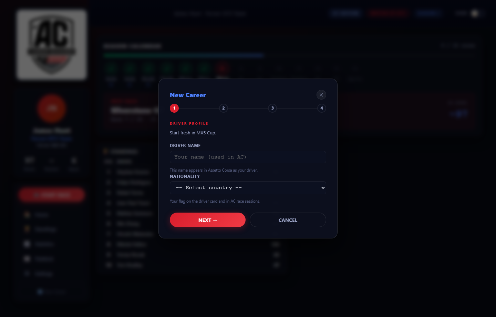
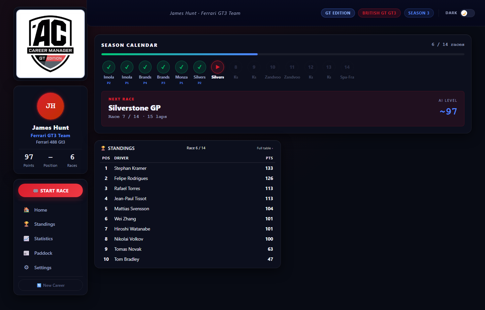
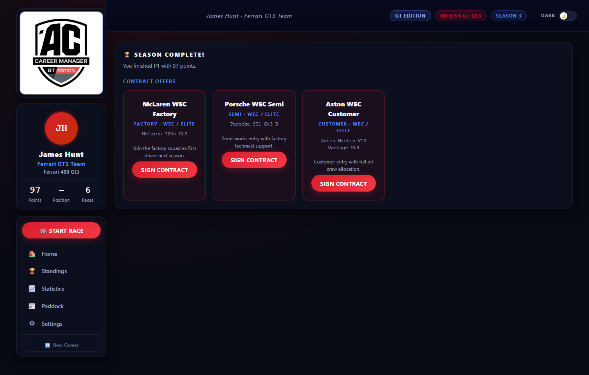
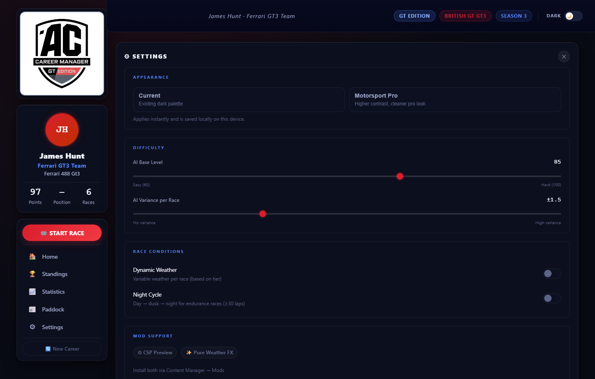
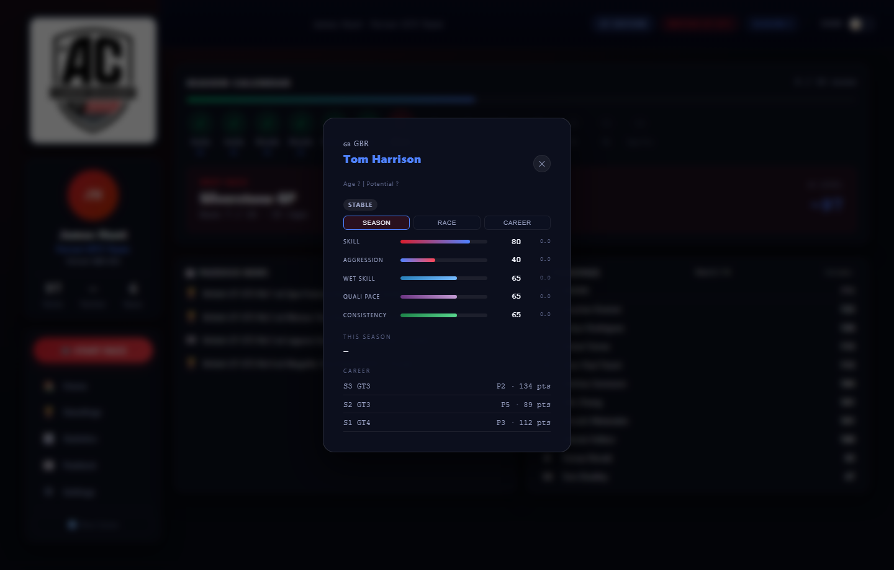
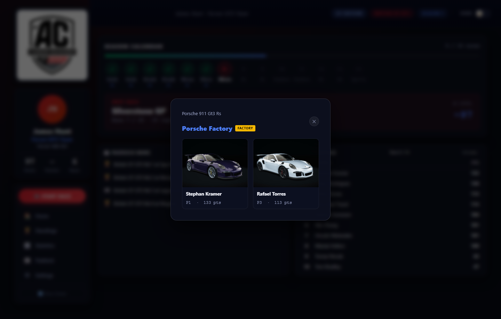
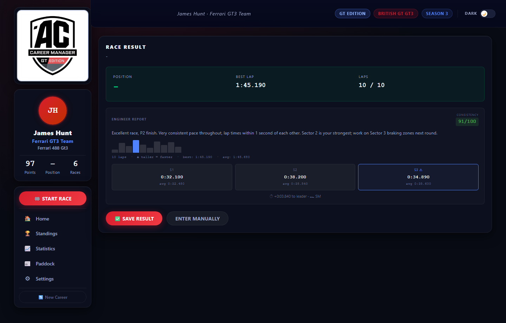

# AC CAREER GT EDITION
## Professional Racing Career Simulator for Assetto Corsa

**Version:** 1.17.0
**Platform:** Windows 10/11 · Linux (Steam Proton)
**Python:** 3.12 (required — pywebview does not support 3.13/3.14)

---

## OVERVIEW

AC Career GT Edition adds a full career mode to Assetto Corsa. It runs in its own native window (no browser needed).

**Career & Progression**
- 4-tier ladder: MX5 Cup (12 races) → GT4 (12 races) → GT3 (14 races) → WEC (8 races)
- End-of-season contracts based on championship finish; real promotion and relegation
- Career Wizard: choose difficulty (Rookie/Amateur/Pro/Legend), weather mode, and scan your AC library for custom track pools

**On Track**
- Full Race Weekend (Practice + Qualifying + Race) or Race Only, one AC launch
- 120 unique AI drivers with individual skill, aggression, and personality archetypes
- Post-race engineer debrief: consistency score, lap sparkline, pace trend analysis
- Pre-flight check warns if a track/car mod is missing before launch
- **Dynamic weather** toggle — ON uses the tier's weather pool; OFF forces clear skies every race
- **Night cycle** toggle — endurance races (≥30 laps) progress through afternoon → dusk → night → dawn; requires [Custom Shader Patch (CSP)](https://acstuff.ru/patch/)

**Championships**
- Live Driver and Team standings across all 4 tiers simultaneously
- Click any AI driver for a profile card (nationality, stats, career history)
- **Rival system** — one AI driver per season is marked as your rival (⚔) in standings and debrief
- **Statistics page** — wins, podiums, avg finish, championship position, and full season history

---

## SCREENSHOTS

<table>
<tr>
  <td width="50%"></td>
  <td width="50%"></td>
</tr>
<tr>
  <td width="50%"></td>
  <td width="50%"></td>
</tr>
<tr>
  <td width="50%"></td>
  <td width="50%"></td>
</tr>
<tr>
  <td colspan="2"></td>
</tr>
</table>

---

## DOWNLOAD

### Windows
**[⬇ Download AC_Career_GT_Edition.exe (v1.16.0)](https://github.com/corveck79/ac-career-manager/releases/latest/download/AC_Career_GT_Edition.exe)**

- Windows 10/11 · No Python needed · ~13 MB single file
- Requires Assetto Corsa installed via Steam

### Linux (AppImage)
**[⬇ Download AC_Career_GT_Edition-1.16.0-x86_64.AppImage](https://github.com/corveck79/ac-career-manager/releases/latest/download/AC_Career_GT_Edition-1.16.0-x86_64.AppImage)**

- Requires Assetto Corsa installed via **Steam + Proton**
- Requires `libwebkit2gtk-4.0` or `libwebkit2gtk-4.1` (GTK WebView):

```bash
# Ubuntu / Debian / Pop!_OS
sudo apt install gir1.2-webkit2-4.0 python3-gi

# Fedora
sudo dnf install webkit2gtk3

# Arch / Manjaro
sudo pacman -S webkit2gtk
```

```bash
chmod +x AC_Career_GT_Edition-1.16.0-x86_64.AppImage
./AC_Career_GT_Edition-1.16.0-x86_64.AppImage
```

> **Note:** AC is launched via `steam -applaunch 244210`. Make sure Steam is running before clicking **START RACE**.
> AC Documents path is auto-detected from `~/.steam/steam/steamapps/compatdata/244210/pfx/...`

---

## QUICK START

**Requirements:**
- Python **3.12** (not 3.13 or 3.14 — pywebview requires 3.12)
- Windows 10/11 (Edge WebView2 is pre-installed)
- Assetto Corsa installed via Steam

**Installation:**
```bash
# 1. Clone the project
git clone https://github.com/corveck79/ac-career-manager.git

# 2. Open command prompt in the app folder
# 3. Create virtual environment with Python 3.12
py -3.12 -m venv venv
venv\Scripts\activate

# 4. Install dependencies
pip install -r requirements.txt

# 5. Start the app
start.bat        # recommended: handles venv automatically
# OR
python app.py    # same result
```

On first run, a setup screen appears — enter your Assetto Corsa install path (or use the folder button to browse).

---

## FILE STRUCTURE

```
ac-career-manager/
├── app.py                    # Flask backend + pywebview window
├── career_manager.py         # Career logic & game rules
├── config.json              # All configuration (tunable!)
├── requirements.txt         # Python dependencies
├── start.bat               # Quick start script (auto-creates venv)
├── build.bat               # Build standalone EXE
│
├── templates/
│   └── dashboard.html      # Web UI (HTML)
│
└── static/
    ├── style.css          # CSS styling
    └── app.js             # Frontend JavaScript
```

---

## CONFIGURATION

Settings can be changed in the **Settings panel** (⚙ button in the app):
- AI base level (slider)
- AI variance per race (slider)
- Dynamic weather ON/OFF toggle (default ON) — OFF = always clear weather
- Night cycle ON/OFF toggle (default ON) — day/night progression for endurance races (≥30 laps)
  - **Requires [Custom Shader Patch (CSP)](https://acstuff.ru/patch/)** for full time-of-day progression
  - Without CSP the race starts at a fixed sun position; the app warns you in the pre-flight check
- Assetto Corsa install path (with folder browser)

For advanced changes, edit `config.json` while the app is **stopped**.

### AC install path:
```json
"paths": {
  "ac_install": "C:\\Program Files (x86)\\Steam\\steamapps\\common\\assettocorsa"
}
```

### AI difficulty:
```json
"difficulty": {
  "base_ai_level": 95,
  "ai_variance": 1.5
}
```
Career Wizard difficulty presets apply an offset: Rookie −10 (AI 85), Amateur −5 (AI 90), Pro ±0 (AI 95), Legend +5 (AI 100).

---

## MOD SUPPORT — CSP & PURE

The app detects [Custom Shader Patch (CSP)](https://acstuff.ru/patch/) and [Pure Weather FX](https://www.patreon.com/peterboese) automatically. Install both via **Content Manager → Mods**. The Settings screen shows a green badge for each detected mod.

| Feature | Base AC | + CSP Preview | + CSP & Pure |
|---------|:-------:|:-------------:|:------------:|
| Weather presets (grip simulation) | ✅ | ✅ | ✅ |
| Rain & overcast visuals | ❌ | ✅ | ✅ |
| Rain on windscreen & road reflections | ❌ | ✅ | ✅ ✨ |
| Day / Night cycle during endurance races | ❌ | ✅ | ✅ |
| Realistic sky, lighting & atmosphere | ❌ | ❌ | ✅ ✨ |

> ✨ = visually enhanced by Pure Weather FX

---

## HOW TO PLAY

### Starting a Career
1. Click **"New Career"** in the app
2. Enter your driver name
3. You start in **MX5 Cup** with **Mazda Academy**
4. Dashboard shows your team, points, and next race

### Race Workflow
1. Click **"START RACE"** button
2. Review race details in modal
3. Choose **Full Weekend** (Practice + Qualifying + Race) or **Race Only**
4. Assetto Corsa opens and runs all sessions automatically
5. **Drive** in AC — AC handles session transitions
6. Close AC when done, then return to the app
7. Click **"Fetch Result from AC"** — position and best lap are read automatically
8. Confirm the result (or enter manually if needed)

### End of Season
After completing all races:
1. Season completes automatically
2. You receive contract offers based on your championship position:
   - **Top finishers** → promotion offers from higher-tier teams
   - **Bottom 3 finishers** → stay offers (worst seat in current tier) and/or relegation offers (top teams in tier below)
3. Choose which team/car you want next season
4. Your difficulty/weather settings carry over automatically

### Championship Points (F1 standard)
P1: 25 · P2: 18 · P3: 15 · P4: 12 · P5: 10 · P6: 8 · P7: 6 · P8: 4 · P9: 2 · P10: 1

---

## CAREER PROGRESSION

### Tier 1: MX5 Cup (Junior)
- Car: Mazda MX5 Cup (one-make)
- Teams: 14 · AI Difficulty: base − 4
- **12 races** (6 venues × 2 sprints): Silverstone National, Brands Hatch Indy, Magione, Black Cat County, Vallelunga, Red Bull Ring

### Tier 2: GT4 SuperCup
- Cars: Porsche Cayman GT4, Maserati GT MC GT4, Lotus 2-Eleven GT4
- Teams: 16 · AI Difficulty: base − 2
- **12 races** (6 venues × 2 races): Monza, Spa, Zandvoort, Silverstone GP, Nürburgring GP, Barcelona

### Tier 3: British GT GT3
- Cars: Ferrari 488 GT3, Porsche 911 GT3, McLaren 650 GT3, BMW Z4 GT3, Lamborghini Huracán, Mercedes AMG GT3, Nissan GTR GT3, and more
- Teams: 20 (Factory / Semi-Factory / Customer) · AI Difficulty: base + 0
- **14 races** (8 events, no duplicate venues): Imola×2, Brands Hatch×2, Monza endurance, Silverstone×2, Nürburgring×2, Zandvoort×2, Barcelona×2, Spa endurance finale

### Tier 4: WEC / Elite Endurance
- Cars: GT3 lineup, endurance setup
- Teams: 10 elite teams · AI Difficulty: base + 1.5
- **8 races** (8 events, 1 endurance each): Imola, Spa, Monza, Silverstone GP, Nürburgring GP, Zandvoort, Barcelona, Spa (finale)

---

## TROUBLESHOOTING

### App shows setup screen on startup
- Enter your AC install path (folder containing `acs.exe`)
- Steam default: `C:\Program Files (x86)\Steam\steamapps\common\assettocorsa`

### "AC not found" / race doesn't launch
- Check AC install path in Settings or `config.json`
- The folder name is lowercase: `assettocorsa` (not `Assetto Corsa`)

### "Port 5000 already in use"
- `start.bat` kills existing processes on port 5000 automatically
- Or edit `app.py`: `app.run(port=5001)`

### "Race launches but wrong track/car"
- Make sure you launch AC via the app, not manually
- The app writes to `Documents\Assetto Corsa\cfg\race.ini`

### "Career data lost"
- Backup `career_data.json` before editing config
- Delete `career_data.json` to start fresh

### pywebview / pythonnet error on startup
- Make sure your venv uses **Python 3.12** (not 3.13 or 3.14)
- Delete `venv\` and run `start.bat` again — it will recreate with Python 3.12

---

## SYSTEM REQUIREMENTS

- Windows 10/11
- Python **3.12** (install from python.org)
- Assetto Corsa (Steam)
- All required base game DLC cars

---

## LICENSE

Open source — feel free to modify and distribute.
